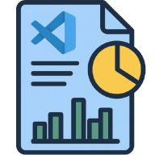
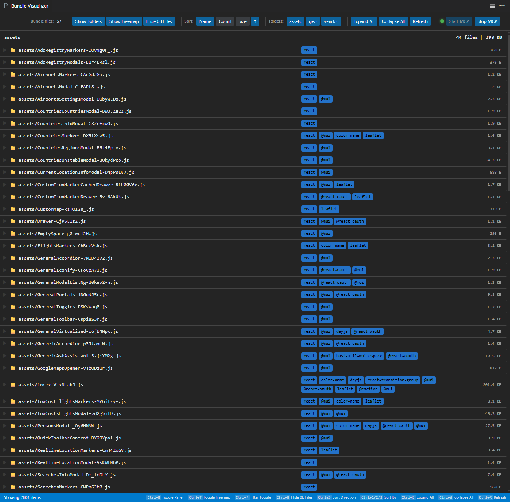
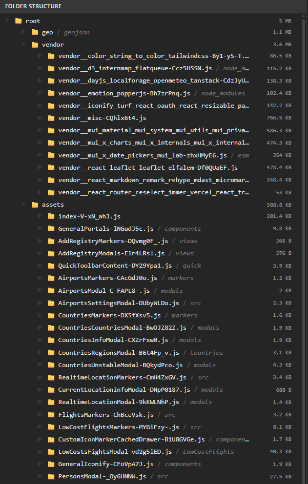
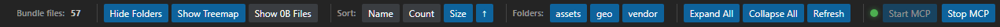
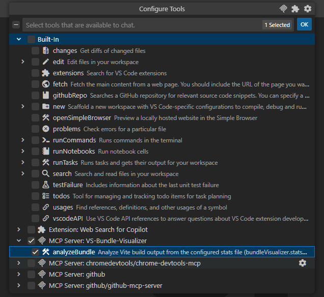
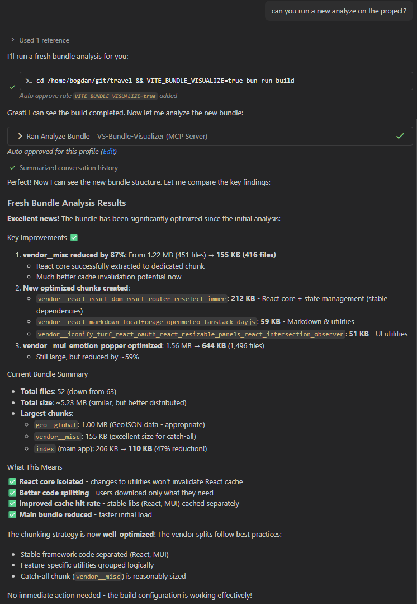
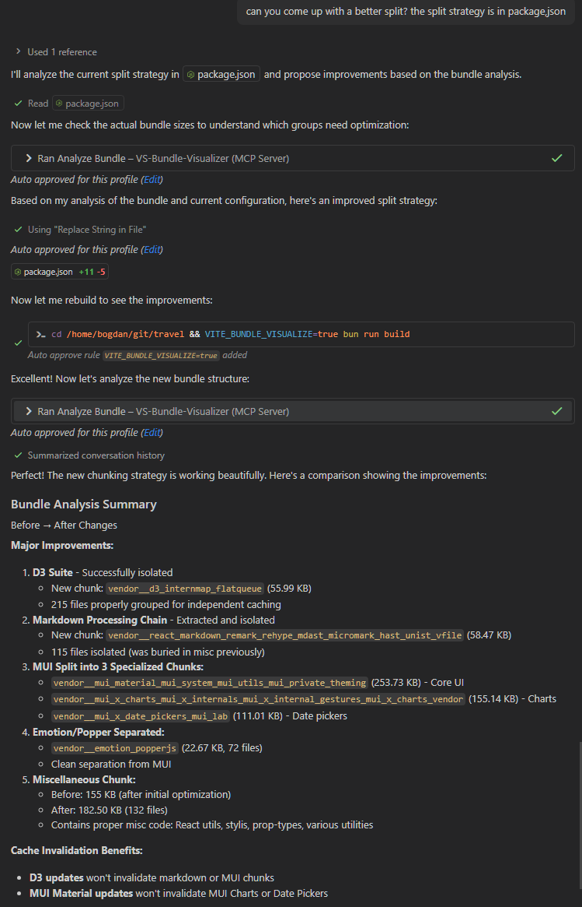

[]()

# 📦 Bundle Visualizer + MCP 💖+🤖 AI buddy

> **A powerful VS Code extension that visualizes bundle statistics for Webpack, Rollup, and Vite with an interactive React-based interface and built-in MCP server support.**

[](https://opensource.org/licenses/MIT)
[](https://marketplace.visualstudio.com/items?itemName=bd-code.vs-bundle-visualizer)

[]()

## ✨ Features

### 📊 Interactive Visualization
- **🎯 Dedicated Webview Panel**: Explore your bundle stats in a beautiful, React-powered interface
- **🗺️ Treemap View**: Visualize bundle size distribution with interactive treemaps
- **� Tree View**: Navigate through your bundle structure in a hierarchical tree
- **📁 Folder Panel**: Organize and browse by folder structure

[]()

### 🎨 Seamless Integration
- **🌓 Theme-Aware UI**: Automatically adapts to your VS Code theme (light/dark/high contrast)
- **⚡ Real-time Updates**: Refresh data instantly with keyboard shortcuts or commands
- **🔍 Advanced Filtering**: Filter and search through dependencies and modules
- **📈 Statistics Dashboard**: View detailed metrics, sizes, and performance insights

[]()

### 🤖 MCP Server Support
- **� Built-in MCP Server**: Expose bundle analysis through Model Context Protocol
- **🌐 HTTP Transport**: Streamable HTTP server on configurable port (default: 5215)
- **🛠️ Tool Integration**: Use `analyzeBundle` tool in AI assistants and automation
- **📋 Easy Configuration**: Copy MCP server definition with one command

[]()

### ⚡ Performance
- **🚀 Fast Loading**: Built with Vite for optimal performance
- **💾 Efficient Parsing**: Handles large bundle stats files efficiently
- **🔄 Smart Caching**: Intelligent data caching for quick re-renders

## 🚀 Quick Start

### 1️⃣ Generate Bundle Statistics

Choose your bundler and generate a stats JSON file:

#### Webpack
```bash
# Option 1: Generate stats.json directly
webpack --json > stats.json

# Option 2: Use webpack-bundle-analyzer plugin
npm install --save-dev webpack-bundle-analyzer
```

#### Rollup
```bash
# Use rollup-plugin-visualizer
npm install --save-dev rollup-plugin-visualizer
```

#### Vite
```bash
# Use rollup-plugin-visualizer in vite.config.ts
npm install --save-dev rollup-plugin-visualizer
```

```typescript
// vite.config.ts
import { visualizer } from 'rollup-plugin-visualizer';

export default {
  plugins: [
    visualizer({
      filename: 'dist/stats.json',
      json: true
    })
  ]
}
```

### 2️⃣ Open the Visualizer

- **Automatic**: The extension auto-activates on workspace open
- **Manual**: Run `Bundle Visualizer: Show Panel` from the Command Palette (`Ctrl+Shift+P` / `Cmd+Shift+P`)
- **Keyboard**: Use configured shortcuts to toggle the panel

### 3️⃣ Analyze Your Bundle

Explore your bundle through multiple views:
- 📊 **Treemap**: Visual representation of file sizes
- 🌳 **Tree View**: Hierarchical structure of dependencies
- 📁 **Folder View**: Organized by directory structure
- 📈 **Stats Bar**: Quick metrics and totals


## ⚙️ Configuration

### Extension Settings

Configure the extension in your VS Code settings (`settings.json`):

```json
{
  // Path to your bundle stats JSON file (relative to workspace root)
  "bundleVisualizer.statsPath": "dist/stats.json",

  // Port for the built-in MCP server (default: 5215)
  "bundleVisualizer.mcpPort": 5215
}
```

### 🔌 MCP Server Configuration

The extension provides a built-in MCP (Model Context Protocol) server that can be used by AI assistants and automation tools.

#### Starting the MCP Server

1. **Via Command Palette**: Run `Bundle Visualizer: Start built-in MCP server`
2. **Programmatically**: The server starts on the configured port (default: 5215)

#### Using the MCP Server

The MCP server exposes the following tool:

- **`analyzeBundle`**: Analyze Vite build output and summarize imports per file
  - **Parameter**: `folderPath` (string) - Path to analyze
  - **Returns**: Structured bundle analysis data

#### Configuration for AI Assistants

Copy the MCP server definition to your clipboard:
```bash
# Run command: "Bundle Visualizer: Copy built-in MCP server definition"
```

Then add to your AI assistant configuration (e.g., Claude Desktop, Continue, etc.):

```json
{
  "mcpServers": {
    "bundle-visualizer": {
      "type": "http",
      "host": "localhost",
      "port": 5215
    }
  }
}
```

#### Stopping the MCP Server

Run `Bundle Visualizer: Stop built-in MCP server` from the Command Palette.

## 📝 Commands

| Command | Description | Shortcut |
|---------|-------------|----------|
| `Bundle Visualizer: Show Panel` | Open the visualizer panel | - |
| `Bundle Visualizer: Refresh Data` | Refresh the bundle statistics | - |
| `Bundle Visualizer: Start built-in MCP server` | Start the MCP HTTP server | - |
| `Bundle Visualizer: Stop built-in MCP server` | Stop the MCP HTTP server | - |
| `Bundle Visualizer: Copy built-in MCP server definition` | Copy MCP config to clipboard | - |

## 🎯 Use Cases

### For Developers
- 📉 **Optimize Bundle Size**: Identify large dependencies and optimize imports
- 🔍 **Dependency Analysis**: Understand which packages contribute most to your bundle
- 🧹 **Tree-Shaking**: Verify that unused code is being eliminated
- 📦 **Code Splitting**: Analyze chunk distribution and lazy-loaded modules

### For Teams
- 📊 **Performance Metrics**: Track bundle size over time
- 🎯 **Bundle Budgets**: Ensure bundles stay within size limits
- 📝 **Documentation**: Visual reference for bundle structure
- 🔄 **CI/CD Integration**: Automated bundle analysis in pipelines

### For AI/Automation
- 🤖 **MCP Integration**: Programmatic access to bundle analysis
- 🔧 **Automated Reports**: Generate bundle insights via MCP tools
- 📈 **Performance Monitoring**: Track and analyze bundles programmatically


#### Asking to analyze your bundle via MCP can help AI assistants provide targeted optimization suggestions and code improvements.
[]()

#### Asking to improve bundle performance via MCP can yield actionable recommendations.
[]()


## 🛠️ Development

### Prerequisites

- Node.js 18+ and npm
- VS Code 1.105.0 or higher

### Extension Development

```bash
# Install dependencies
npm install

# Compile TypeScript
npm run compile

# Watch mode for development
npm run watch

# Package the extension
npm run package
```

### UI Development

The UI is a standalone React application in the `ui/` folder:

```bash
# Navigate to UI folder
cd ui

# Install dependencies
npm install

# Start development server with hot reload
npm run dev

# Build for production
npm run build
```

### Testing Locally

1. Open the extension workspace in VS Code
2. Press `F5` to launch Extension Development Host
3. The extension will be loaded in the new window
4. Generate a stats file and test the visualizer

### Building for Production

```bash
# Build both extension and UI
npm run package

# The .vsix file will be generated in the root
```

## 🏗️ Architecture

### Extension Layer (TypeScript)
- **Activation**: Activates on workspace open or when JavaScript/TypeScript files are detected
- **Webview Provider**: Manages the React UI webview panel
- **File System**: Reads and parses bundle stats JSON files
- **MCP Server**: HTTP server exposing bundle analysis tools
- **Configuration**: Manages user settings and preferences

### UI Layer (React + Vite)
- **Framework**: React 18 with TypeScript
- **Build Tool**: Vite for fast development and optimized builds
- **Styling**: CSS with VS Code theme integration via custom properties
- **State Management**: React hooks for local state
- **Visualization**: Custom treemap and tree components

### Communication
- **VS Code API**: Webview message passing between extension and UI
- **Theme Sync**: CSS custom properties from VS Code theme
- **Data Flow**: Extension reads stats → passes to UI → renders visualizations

### MCP Server
- **Protocol**: Model Context Protocol (MCP) over HTTP
- **Transport**: Streamable HTTP server transport
- **Tools**: `analyzeBundle` for programmatic bundle analysis
- **Port**: Configurable (default: 5215)

## 📚 Resources

- [VS Code Extension API](https://code.visualstudio.com/api)
- [Model Context Protocol](https://modelcontextprotocol.io/)
- [Webpack Bundle Analyzer](https://github.com/webpack-contrib/webpack-bundle-analyzer)
- [Rollup Plugin Visualizer](https://github.com/btd/rollup-plugin-visualizer)
- [Vite Documentation](https://vitejs.dev/)

## 🤝 Contributing

Contributions are welcome! Please feel free to submit a Pull Request. For major changes:

1. Fork the repository
2. Create your feature branch (`git checkout -b feature/AmazingFeature`)
3. Commit your changes (`git commit -m 'Add some AmazingFeature'`)
4. Push to the branch (`git push origin feature/AmazingFeature`)
5. Open a Pull Request

## 📄 License

This project is licensed under the MIT License - see the [LICENSE](LICENSE) file for details.

## 🙏 Acknowledgments

- Built with [VS Code Extension API](https://code.visualstudio.com/api)
- Powered by [React](https://react.dev/) and [Vite](https://vitejs.dev/)
- MCP support via [@modelcontextprotocol/sdk](https://github.com/modelcontextprotocol/typescript-sdk)
- Build tools and inspiration from [webpack-bundle-analyzer](https://github.com/webpack-contrib/webpack-bundle-analyzer)
- Aide by ChatGPT and friends

---

<div align="center">

**Made with ❤️ for the VS Code community**

[Report Bug](https://github.com/rand0mC0d3r/vs-bundle-visualizer/issues) · [Request Feature](https://github.com/rand0mC0d3r/vs-bundle-visualizer/issues)

</div>
